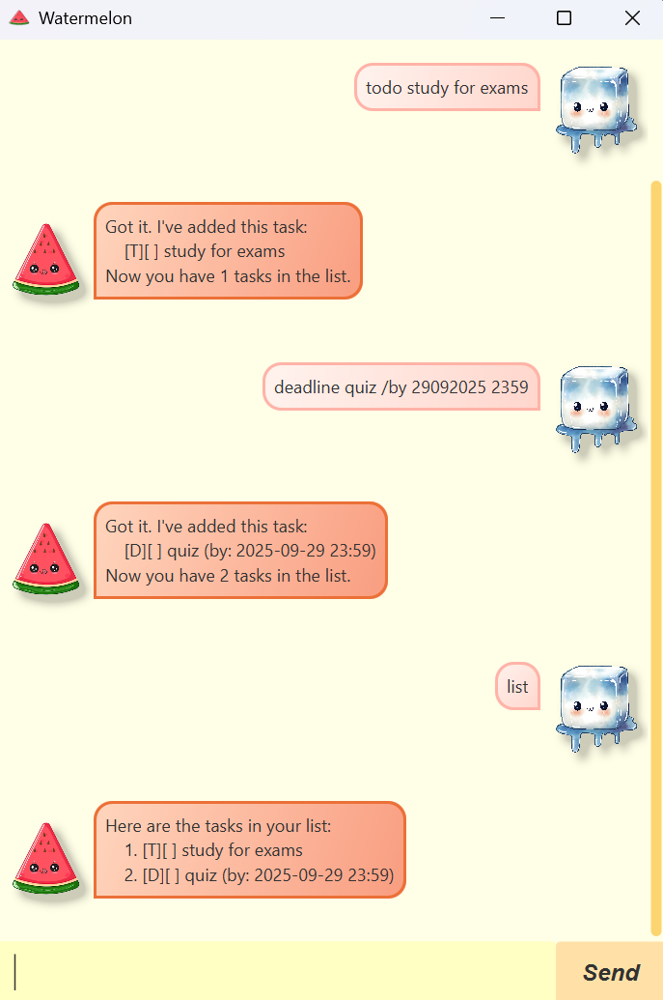

# Watermelon User Guide

<p align="center">
  
</p>

<p align="center"><span style="font-size: 10px;">
  Watermelon icon: <a href="https://www.freepik.com/premium-vector/cute-happy-watermelon-cartoon-illustration_27859519.htm">Freepik</a> &nbsp;|&nbsp;
  User icon: <a href="https://favpng.com/png_view/ice-melt-cute-ice-cube-cartoon-png/ShcAGEdu">favpng.com</a>
</span></p>

Watermelon is an **interactive and easy-to-use task manager** that helps you keep track of your todos, deadlines, and events. 
You can add, list, mark as done, delete, find tasks and view your schedule for any day easily using simple commands.

---

## Table of Contents

- [Quick Start](#quick-start)
- [Command Summary](#command-summary)
- [Adding Tasks](#adding-tasks)
  - [Todo](#todo)
  - [Deadline](#deadline)
  - [Event](#event)
- [Listing Tasks](#listing-tasks)
- [Marking Tasks](#marking-tasks)
  - [Marking Tasks as Done](#marking-tasks-as-done)
  - [Marking Tasks as Undone](#marking-tasks-as-undone)
- [Deleting Tasks](#deleting-tasks)
- [Finding Tasks](#finding-tasks)
- [Viewing Schedule for a Specific Day](#viewing-schedule-for-a-specific-day)
- [Exiting the Application](#exiting-the-application)

---

## Quick Start

1. Ensure you have **Java 17 or above** installed on your computer.  
   *Mac users: Ensure you have the precise JDK version prescribed [here](https://docs.oracle.com/en/java/javase/17/install/overview-jdk-installation.html).*

2. Download the latest `.jar` file from [here](https://github.com/watermelonisred/ip/releases).

3. Copy the file to the folder you want to use as the home folder for your Watermelon tasks.

4. Open a command terminal, `cd` into the folder you put the jar file in, and use the following command to run the application:
   ```
   java -jar watermelon.jar
   ```

---

## Command Summary

| Command Format                                                  | Description |
|-----------------------------------------------------------------| ----------- |
| `todo <description>`                                            | Adds a todo task |
| `deadline <description> /by <ddMMyyyy HHmm>`                    | Adds a deadline task |
| `event <description> /from <ddMMyyyy HHmm> /to <ddMMyyyy HHmm>` | Adds an event task |
| `list`                                                          | Lists all tasks |
| `mark <task number>`                                            | Marks a task as done |
| `unmark <task number>`                                          | Marks a task as not done |
| `delete <task number>`                                          | Deletes a task |
| `find <keyword>`                                                | Finds tasks containing the keyword |
| `schedule <ddMMyyyy>`                                           | Shows tasks scheduled for a specific date (leave blank for today) |
| `bye`                                                           | Exits the application |

**Remarks:**
- For `deadline` and `event` commands, please enter dates and times in the format: `ddMMyyyy HHmm` (eg. `30062024 2359` for 30 June 2024, 11:59 PM).
- For `schedule` command, please enter dates in the format: `ddMMyyyy` (eg. `30062024` for 30 June 2024).
- All commands are **case sensitive**. Please enter them exactly as shown.

---

## Adding Tasks

### Todo

Adds a todo task.

**Usage:**  
`todo <description>`

**Example:**  
`todo read book`

**Expected Output:**
```
Got it. I've added this task:
  [T][ ] read book
Now you have 1 task in the list.
```

---

### Deadline

Adds a task with a deadline.

**Usage:**  
`deadline <description> /by <date/time>`

**Example:**  
`deadline submit assignment /by 30062024 2359`

**Expected Output:**
```
Got it. I've added this task:
  [D][ ] submit assignment (by: 2024-06-30 23:59)
Now you have 2 tasks in the list.
```

---

### Event

Adds an event with a specific time.

**Usage:**  
`event <description> /from <date/time> /to <date/time>`

**Example:**  
`event project meeting /from 01072024 1400 /to 01072024 1600`

**Expected Output:**
```
Got it. I've added this task:
  [E][ ] project meeting (from: 2024-07-01 14:00 to: 2024-07-01 16:00)
Now you have 3 tasks in the list.
```

---

## Listing Tasks

Shows all tasks in your list.

**Usage:**  
`list`

**Expected Output:**
```
Here are the tasks in your list:
1.[T][ ] read book
2.[D][ ] submit assignment (by: 2024-06-30 23:59)
3.[E][ ] project meeting (from: 2024-07-01 14:00 to: 2024-07-01 16:00)
```

---

## Marking Tasks

### Marking Tasks as Done

Marks a task as completed.

**Usage:**  
`mark <task number>`

**Example:**  
`mark 2`

**Expected Output:**
```
Nice! I've marked this task as done:
  [D][X] submit assignment (by: 2024-06-30 23:59)
```

### Marking Tasks as Undone

Marks a task as not completed.

**Usage:**  
`unmark <task number>`

**Example:**  
`unmark 2`

**Expected Output:**
```
OK, I've marked this task as not done yet:
  [D][X] submit assignment (by: 2024-06-30 23:59)
```
---

## Deleting Tasks

Deletes a task from your list.

**Usage:**  
`delete <task number>`

**Example:**  
`delete 1`

**Expected Output:**
```
OK, I've removed this task:
  [T][ ] read book
Now you have 2 tasks in the list.
```

---

## Finding Tasks

Finds tasks that contain a keyword.

**Usage:**  
`find <keyword>`

**Example:**  
`find project`

**Expected Output:**

If there are matching tasks:
```
Here are the matching tasks I found:
1.[E][ ] project meeting (from: 2024-07-01 14:00 to: 2024-07-01 16:00)
```
If there are no matching tasks:
```
Oops! I can't find any matching tasks.
```
---

## Viewing Schedule for a Specific Day

Displays all tasks scheduled for a specific date.  
If no date is provided, shows tasks scheduled for today.

**Usage:**  
`schedule <date>`  
`schedule` (shows today's schedule)

**Example:**  
`schedule 30062024`

**Expected Output:**

If there are tasks scheduled for that day:
```
Here are your tasks scheduled for 2024-06-30:
1.[D][ ] submit assignment (by: 2024-06-30 23:59)
2.[E][ ] project meeting (from: 2024-06-30 14:00 to: 2024-06-30 16:00)
```
If there are no tasks scheduled for that day:
```
No tasks scheduled for 2024-06-30!
```

**Example (no date, shows today):**  
`schedule`

**Expected Output:**
```
Here are your tasks scheduled for today:
1.[D][ ] submit assignment (by: 2024-06-30 23:59)
```
---

## Exiting the Application

Exits Watermelon.

**Usage:**  
`bye`

**Expected Output:**
```
Bye! Hope to see you again soon! :D
```

---
